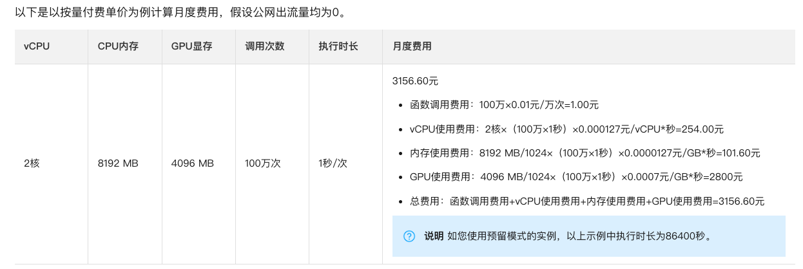
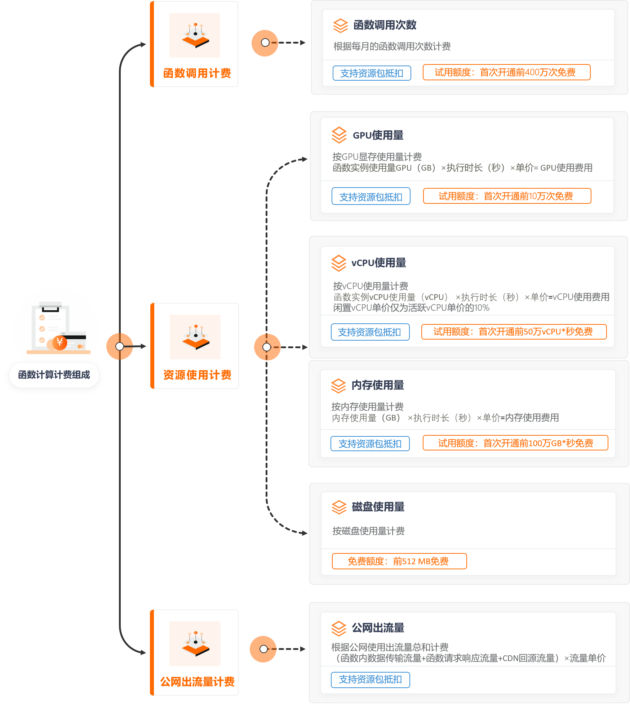

# batchOptimize

## Serverless Function Cost

本文对国内外云服务商Serverless Functions计价进行调研，仅用作学术研究，实际定价请自行访问文档。

### Ali Cloud

阿里云Serverless计价事例（不考虑公网流量）:

$$
C_{Ali}=I\times T\times (N_{CPU}\times P_{CPU}+M\times P_{Mem}+N_{GPU}\times P_{GPU})+I\times P_{req}
$$

其中$I$为调用次数，T为函数持续时间，$N_{CPU}$， $M$, $N_{GPU}$分别为CPU核数，1024MB单位内存数和1024MB单位显存数，$P_{CPU}$, $P_{Mem}$ 和 $P_{GPU}$为单位CPU，内存，GPU价格,$P_{req}$为单次函数调用价格，此公式为函数触发时的价格。

如果实例在一段时间内（一般为3~5分钟）不处理请求，会自动销毁。首次发起调用时，需要等待实例冷启动。如果预热（Keep alive）的话GPU$(P_{GPU})$和CPU$P_{CPU}$分别为活跃时的$10\%$，内存单价$P_{Mem}$则不变。

### Tencent Cloud

与Ali云类似，不过在部署函数时只能调整内存资源。

$$
C_{Tencent} = I\times T\times M \times P_{Mem} + I\times P_{req} + C\times D
$$

其中$I$为调用次数，T为函数持续时间，M为分配内存数量，$P_{req}$ 为单次调用单价，$C$为每日门槛价格，$D$为使用天数。

下面一个案例给出了闲置资源价格为 0.00005471元/GBs，仅算内存占用价格。

### Huawei Cloud

华为云采用阶梯计费方式，只能分配内存，其余计价方式与腾讯云类似，不清楚闲置成本。

1. 华为云函数工作流FunctionGraph按照实际使用量付费，没有最低消费。计费模式采用累计分档计费，请求次数和计量时间均按月累计使用量，按天扣费。
2. 总费用 = 请求次数费用 + 计量时间费用。
3. 未使用预留实例的情况下，函数计算资源消耗是函数所选内存和函数执行时间的乘积，执行时间是从函数代码开始执行的时间算起到其返回或终止的时间为止，计量的粒度是1毫秒，不足1毫秒按1毫秒计费，例如函数执行了0.5毫秒，会按照1毫秒计费。例如函数内存规格为512MB，函数执行1秒的计算资源消耗为：0.5GB*1秒= 0.5GB-秒，其他内存规格依此类推。
4. 使用预留实例的情况下，资源消耗计算稍有不同，FunctionGraph根据预留实例设置在实例创建成功后开始计时。如果预留实例存活时间不足1分钟，将按照 1 分钟计算，超过一分钟的部分，按照秒的粒度向上取整计算。例如一个512M的函数预留实例运行时间为 51 秒，将按照1分钟计算，计算资源消耗为 0.5G * 60s = 30GB-秒。运行时间为 60.5 秒，则计费时间为 61 秒，计算资源消耗为0.5G * 61s = 30.5GB-秒。
5. 计费时，FunctionGraph将累加各个函数的计算资源消耗。例如当前账号下有两个函数A和B，A函数累计请求次数为200万次，计量时间为200,000GB-秒，B函数请求次数为200万次，计量时间为300,000GB-秒，那么请求次数费用为：￥1.33 元/100万次 *（ 200万次 + 200万次 - 100万次） = ￥3.99元， 计量时间费用为：￥0.00011108 元/GB-秒 *（ 200,000GB-秒 + 300,000GB-秒 - 400,000GB-秒） = ￥11.108元，总费用为：￥3.99元 + ￥11.108元 = ￥15.098元。

### AWS Lambda

AWS Lambda 服务计价估计网站：https://calculator.aws/#/estimate

Lambda计算公式：

$$
C_{\text {Lambda }}=(S \cdot M \cdot I) \cdot K_1+I \cdot K_2,
$$

where S is the length of the function call (referred as batch service time here), M is the memory allocated for the function, I is the number of calls to the function that decreases when requests are batched together, K1 (i.e., $1.66667 · 10^{−5} $/GB-s) is the cost of the memory, and K2 (i.e., $2 · 10^{−7} $) is the cost of each call to the function.

预配置并发定价（即keep alive，闲置定价）：

### Google Cloud Platform (GCP)

GCP函数资源分配较为单一，只能从7种配置中选择。

简单来说GCP定价与阿里云基本一致，详情事例：

一个预配了 128 MB 内存和一个 200 MHz CPU 的简单事件驱动函数，每个月调用 1 千万次，每次运行 300 毫秒，并且仅使用 Google API（无计费出站流量）。调用1000万次，则时间为：

1. (128 MB/1024 MB/GB) x 0.3 秒 = 每次调用 0.0375 GB 秒
2. (200 MHz/1000 MHz/GHz) x 0.3 秒 = 每次调用 0.0600 GHz 秒
3. 10000000 次调用 x 0.0375 GB 秒 = 每月 375000 GB 秒
4. 10000000 次调用 x 0.0600 GHz 秒 = 每月 600000 GHz 秒

### Azure Function

整体同AWS

